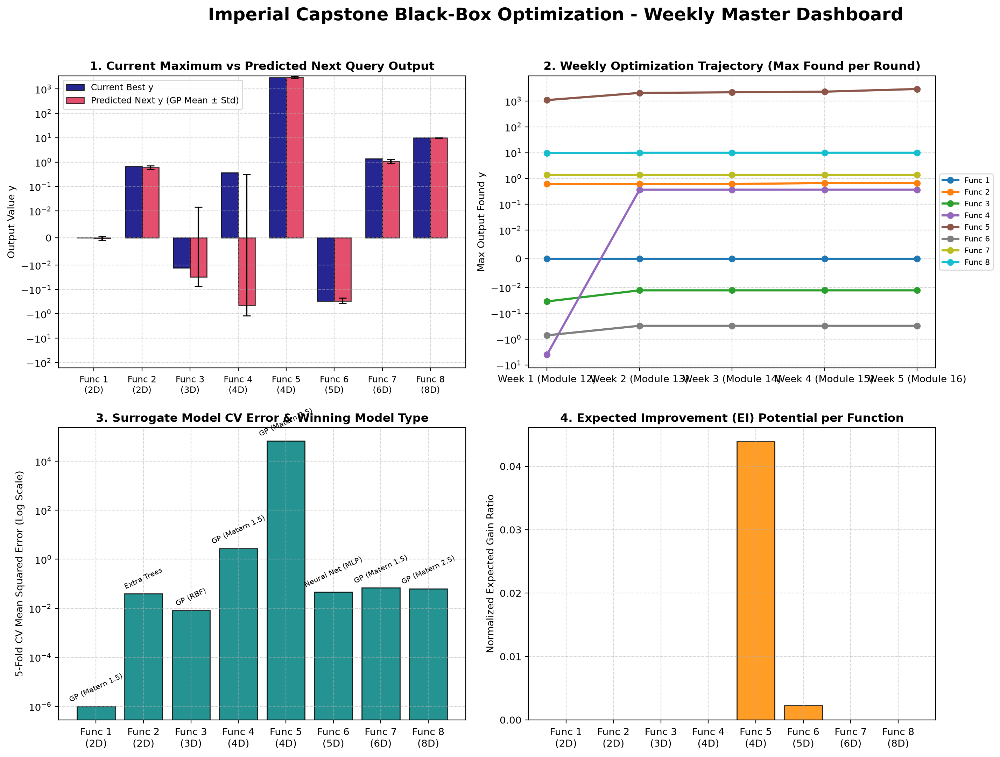

# Black-Box Optimization (BBO) Capstone Project
**Imperial College London - Machine Learning & AI Capstone**

An automated, robust, and reproducible machine learning pipeline for black-box optimization (BBO) across 8 synthetic continuous functions spanning 2D to 8D input domains under strict weekly evaluation budgets.

---

## 1. Executive Summary & Optimization Trajectory

This repository implements a modular, surrogate-driven optimization framework. Across sequential weekly evaluation rounds, the system benchmarks probabilistic models (Gaussian Processes with Matérn and RBF kernels) against deterministic machine learning surrogates (Neural Networks / Multi-Layer Perceptrons, Extra Trees, Random Forests, Gradient Boosting, and Polynomial Ridge Regression), computing acquisition functions to guide high-yield candidate selection.



### 1.1 Multi-Week Performance Milestones (Week 1 to Week 5)

| Function | Dimension | Initial to W5 Samples | Initial Max y | Current Best y | Total Gain | Current Status |
| :--- | :---: | :---: | :---: | :---: | :---: | :--- |
| **Function 1** | 2D | 10 to 14 | 7.71e-16 | 7.71e-16 | Baseline | Bounded upper ridge |
| **Function 2** | 2D | 10 to 14 | 0.611205 | **0.664342** | +0.0531 | New Record High |
| **Function 3** | 3D | 15 to 19 | -0.034835 | **-0.012927** | +0.0219 | Unlocked central mode |
| **Function 4** | 4D | 30 to 34 | -4.025542 | **+0.367529** | +4.3931 | Positive Domain Discovery |
| **Function 5** | 4D | 20 to 24 | 1088.859618 | **2921.374749** | **+1832.52** | 🚀 Exponential Peak Surge |
| **Function 6** | 5D | 20 to 24 | -0.714265 | **-0.305461** | +0.4088 | NN-guided Plateau Mapping |
| **Function 7** | 6D | 30 to 34 | 1.364968 | 1.364968 | Sustained | High-yield Basin Cluster |
| **Function 8** | 8D | 40 to 44 | 9.598482 | **9.929387** | +0.3309 | High Ridge Convergence |

---

## 2. Software Architecture & Methodology

The repository is architected around a unified pipeline (`bbo_pipeline.py`) designed for zero-error execution, strict hypercube bounds enforcement, and automated visual diagnostics.

```
+-------------------------------------------------------------------------------+
|                             DATA INGESTION LAYER                              |
|           Loads function_X/initial_inputs.npy & initial_outputs.npy           |
+---------------------------------------+---------------------------------------+
                                        |
                                        v
+-------------------------------------------------------------------------------+
|                      SURROGATE BENCHMARKING ENGINE (5-Fold CV)                |
|  - Gaussian Processes (Matern 2.5, Matern 1.5, RBF) with Maximum Likelihood   |
|  - Multi-Layer Perceptron Neural Networks (MLP: 64-32, ReLU, L2 Decay)        |
|  - Tree Ensembles (Random Forest, Extra Trees, Gradient Boosting)             |
|  - Polynomial Ridge Regression (Quadratic interactions + L2 penalty)          |
+---------------------------------------+---------------------------------------+
                                        |
                                        v
+-------------------------------------------------------------------------------+
|                       BAYESIAN ACQUISITION & SEARCH ENGINE                    |
|  - Dense Mesh Grid Evaluation (200x200 = 40,000 points for 2D)                |
|  - Monte Carlo / Latin Hypercube Sampling (30,000 candidates for 3D-8D)       |
|  - Expected Improvement (EI) with dynamic range-scaled jitter xi              |
|  - Fallback Upper Confidence Bound (UCB, beta = 2.576)                        |
+---------------------------------------+---------------------------------------+
                                        |
                                        v
+-------------------------------------------------------------------------------+
|                         AUTOMATED ARTIFACT EXPORT                             |
|  - Formats strict portal queries (0.xxxxxx-0.yyyyyy-...)                      |
|  - Generates 4-panel diagnostic figures per function (visualizations/)        |
|  - Updates master weekly tracking dashboard and JSON logs                     |
+-------------------------------------------------------------------------------+
```

---

## 3. Repository Directory Structure

```
.
|-- README.md                             # Master project overview and architecture documentation
|-- bbo_pipeline.py                       # Automated core pipeline (modeling, acquisition, diagnostics)
|-- bbo_weekly_tracking.md                # Comprehensive weekly progression log and reflection answers
|-- weekly_progress_history.json          # Multi-week historical benchmark telemetry
|-- week5_summary.json                    # Serialized model metrics and proposed queries for Week 5
|-- week5_report.md                       # Dedicated Week 5 Module 16 reflection report
|-- week4_report.md                       # Dedicated Week 4 Module 15 reflection report
|-- week3_report.md                       # Dedicated Week 3 Module 14 reflection report
|-- week2_report.md                       # Dedicated Week 2 Module 13 reflection report
|-- capstone_project_brief.docx           # Imperial College Capstone project brief
|
|-- function_1/ ... function_8/           # Function datasets
|   |-- initial_inputs.npy                # Evaluated input coordinate vectors in [0, 1]^d
|   `-- initial_outputs.npy               # Evaluated scalar output values y
|
`-- visualizations/                       # Auto-generated diagnostic plots and master dashboard
    |-- weekly_progress_summary.png       # 4-panel master weekly dashboard
    |-- function_1_week5.png ...          # 4-panel 2D GP landscape and acquisition maps
    `-- function_8_week5.png              # 4-panel high-D sensitivity slices and feature importances
```

---

## 4. Coding Libraries and Environment Setup

The pipeline is built with standard scientific Python packages optimized for small-sample efficiency and deterministic reproducibility:

* **Core ML & Modeling**: `scikit-learn` (GaussianProcessRegressor, MLPRegressor, RandomForestRegressor, ExtraTreesRegressor, GradientBoostingRegressor, Ridge, Pipeline, StandardScaler).
* **Statistical Kernels**: `scipy` (statistical normal CDF/PDF distributions for Expected Improvement, distance metrics).
* **Data & Matrix Operations**: `numpy`, `pandas`.
* **Visualization Engine**: `matplotlib`.

### Quickstart Execution

To reproduce the analysis, evaluate surrogate models, and generate the proposed queries and diagnostic figures:

```bash
# Clone the repository
git clone https://github.com/your-username/bbo-capstone.git
cd bbo-capstone

# Create and activate virtual environment
python -m venv .venv
source .venv/bin/activate  # On Windows: .venv\Scripts\activate

# Install dependencies
pip install numpy scipy pandas scikit-learn matplotlib

# Execute the master weekly pipeline
python bbo_pipeline.py
```

---

## 5. Summary of Current Query Submissions (Week 5)

All coordinates adhere to the project brief format (`0.xxxxxx` with six decimal places):

* **Function 1 (2D)**: `0.321608-0.165829`
* **Function 2 (2D)**: `0.678392-0.879397`
* **Function 3 (3D)**: `0.455167-0.521242-0.486792`
* **Function 4 (4D)**: `0.437086-0.290257-0.382594-0.349796`
* **Function 5 (4D)**: `0.595561-0.993735-0.987345-0.981682`
* **Function 6 (5D)**: `0.437161-0.320742-0.578847-0.762968-0.194246`
* **Function 7 (6D)**: `0.105640-0.347690-0.307992-0.359223-0.329529-0.769180`
* **Function 8 (8D)**: `0.050323-0.062907-0.187347-0.032471-0.743353-0.723330-0.136056-0.836079`
