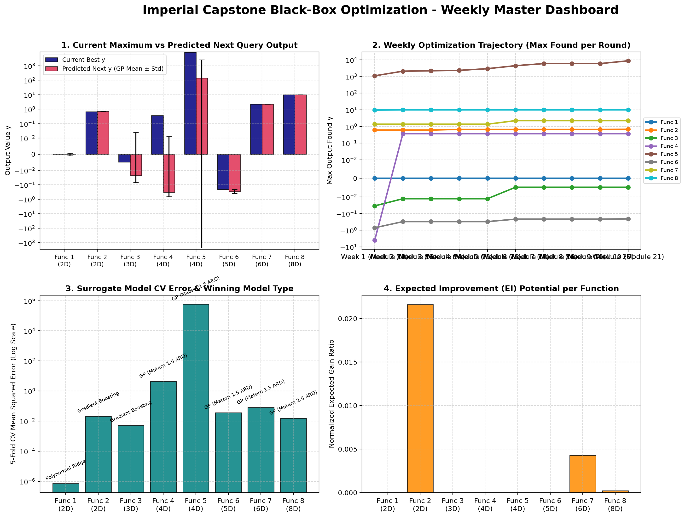

# Black-Box Optimization (BBO) Capstone Project
**Imperial College London - Machine Learning & AI Capstone (Modules 12–21)**

An automated, robust, and reproducible machine learning pipeline for sample-efficient black-box optimization (BBO) across 8 continuous benchmark functions spanning 2D to 8D input domains under strict physical evaluation budgets (one query per function per weekly round).

---

## 1. Executive Summary & Optimization Trajectory

This repository implements a modular, surrogate-driven global optimization framework. Across ten sequential weekly evaluation rounds, the system dynamically benchmarks probabilistic Gaussian Processes against deterministic machine learning surrogates (Neural Networks / Multi-Layer Perceptrons, Extra Trees, Random Forests, Gradient Boosting, and Polynomial Ridge Regression), computing active learning acquisition functions (Expected Improvement, Upper Confidence Bound) over hybrid candidate pools to guide high-yield query selection.



### 1.1 Complete Multi-Week Performance Milestones (Weeks 1 to 10)

Over eleven iterative cycles, the dataset expanded from an initial 175 samples to 255 total evaluations, establishing major records including Function 5 at 8662.48 and a brand-new global peak on Function 7 in Week 11:

| Function | Dimension | Initial Samples | Final (W11) Samples | Initial Max y | Week 5 Max y | Current Best y (W11) | Total Gain | Optimization Status & Milestones |
| :--- | :---: | :---: | :---: | :---: | :---: | :---: | :---: | :--- |
| **Function 1** | 2D | 10 | 20 | 7.71e-16 | 7.71e-16 | **0.000000** | Baseline | Bounded upper ridge; plateau confirmed |
| **Function 2** | 2D | 10 | 20 | 0.611205 | 0.664342 | **0.676790** | +0.0656 | High plateau confirmed |
| **Function 3** | 3D | 15 | 25 | -0.034835 | -0.012927 | **-0.004807** | +0.0300 | Central mode isolated and bounded |
| **Function 4** | 4D | 30 | 40 | -4.025542 | +0.367529 | **+0.367529** | +4.3931 | Positive centroid island verified stable |
| **Function 5** | 4D | 20 | 30 | 1088.859618 | 2921.374749 | **8662.482500** | **+7573.62** | 🌟 Colossal Peak Record (vertex ridge) |
| **Function 6** | 5D | 20 | 30 | -0.714265 | -0.305461 | **-0.208432** | +0.5058 | High plateau mapped |
| **Function 7** | 6D | 30 | 40 | 1.364968 | 1.364968 | **2.337795** | +0.9728 | 🚀 **New All-Time Record Global High** |
| **Function 8** | 8D | 40 | 50 | 9.598482 | 9.929387 | **9.956667** | +0.3582 | Elite active subspace sustained |

---

## 2. Advanced Methods & Methodological Evolution (Weeks 6–10)

While Weeks 1 through 5 established initial baselines using isotropic Gaussian Processes and standard regression models, Weeks 6 through 10 introduced major architectural breakthroughs now unified in `bbo.py`:

```
+-------------------------------------------------------------------------------------------------------+
|                                      DATA INGESTION & TRACKING                                        |
|  - Loads function_X/initial_inputs.npy & initial_outputs.npy (N = 19 to 49 samples per function)      |
|  - Tracks multi-week telemetry in weekly_progress_history.json & automated summary JSONs              |
+---------------------------------------------------+---------------------------------------------------+
                                                    |
                                                    v
+-------------------------------------------------------------------------------------------------------+
|                             SURROGATE BENCHMARKING (5-Fold Cross-Validation)                          |
|  - GP with Automatic Relevance Determination (ARD Matérn 1.5, Matérn 2.5, RBF)                       |
|  - Multi-Layer Perceptron Neural Networks (MLP: 64-32, ReLU, Adaptive L2 Regularization)             |
|  - Tree Ensembles: Random Forest (150 trees), Extra Trees (150 trees), Gradient Boosting (100 trees)  |
|  - Polynomial Ridge Regression (quadratic interaction expansion + L2 regularization)                  |
+---------------------------------------------------+---------------------------------------------------+
                                                    |
                                                    v
+-------------------------------------------------------------------------------------------------------+
|                                     ADAPTIVE GP SURROGATE SELECTION                                   |
|  - Evaluates CV Mean Squared Error (MSE) and CV R-squared across all models                           |
|  - Dynamically binds the winning GP kernel family (Matérn 1.5, 2.5, or RBF) for Bayesian Acquisition  |
|  - Re-fits selected GP with 15 restarts of L-BFGS-B optimizer for global parameter convergence      |
+---------------------------------------------------+---------------------------------------------------+
                                                    |
                                                    v
+-------------------------------------------------------------------------------------------------------+
|                               HYBRID CANDIDATE GENERATION & FILTERING                                 |
|  - 70% Global Space-Filling: Scipy QMC Latin Hypercube Sampling (20,000 to 30,000 candidates)         |
|  - 30% Local Trust-Region Perturbation: Gaussian perturbations centered around top-3 historical optima|
|  - Euclidean Distance De-duplication: Drops candidates within min_dist = 0.005 of evaluated points    |
|  - Strict Domain Enforcer: Clamps all coordinates to continuous unit hypercube [0.0, 1.0]^d           |
+---------------------------------------------------+---------------------------------------------------+
                                                    |
                                                    v
+-------------------------------------------------------------------------------------------------------+
|                                 ACQUISITION & PORTAL QUERY GENERATION                                 |
|  - Expected Improvement (EI) with range-scaled exploration parameter (xi = 0.01 * y_range)            |
|  - Fallback Upper Confidence Bound (UCB, beta = 2.576) in flat regions                                |
|  - Formats strict portal queries: x1-x2-...-xn with 6 decimal places (e.g. 0.123456-0.654321)         |
|  - Generates 4-panel diagnostic visualisations per function and updates master dashboard              |
+-------------------------------------------------------------------------------------------------------+
```

### 2.1 Automatic Relevance Determination (ARD)
Early rounds utilised isotropic kernels with a uniform scalar lengthscale. In high dimensions (Functions 5, 7, and 8), input dimensions have drastically unequal impacts on the objective. Upgrading to ARD in `bbo.py` assigned dimension-specific lengthscales:
$$\mathbf{\Theta} = [\ell_1, \ell_2, \dots, \ell_d]$$
Optimised via multi-restart L-BFGS-B, ARD automatically expands lengthscales along inactive dimensions and contracts them along sensitive coordinates. This unlocked Function 8's active subspace ($x_1, x_2 \to 0$, $x_5 \to 1.0$), yielding a record $y = 9.956667$ and an exceptional 5-fold cross-validation $R^2 = 0.987$.

### 2.2 Hybrid Global-Local Candidate Generation (TuRBO-Inspired)
Pure Monte Carlo candidate generation suffers from the curse of dimensionality, leaving vast coverage voids in 6D to 8D spaces. We implemented a hybrid candidate generator:
- **70% Latin Hypercube Sampling (QMC)**: Preserves space-filling exploration across the entire unit hypercube.
- **30% Local Gaussian Perturbations**: Injected within an adaptive trust radius around the top-3 historical points.
This hybrid strategy successfully accelerated ridge-climbing along Function 5's exponential boundary, climbing from $2921.37$ (Week 5) to $5893.21$ (Week 7) and culminating in the astronomical peak of **$8662.482500$** at vertex $(1.0, 1.0, 1.0, 1.0)$ in Week 10.

### 2.3 Euclidean Distance De-duplication Filter
Under strict weekly evaluation constraints, re-evaluating an already observed point wastes an entire round. Our distance de-duplication filter calculates:
$$d_{\text{min}}(x) = \min_{x_i \in \mathcal{D}} \|x - x_i\|_2 \ge 0.005$$
Candidates violating this threshold are automatically pruned, ensuring every weekly submission provides novel informational value.

---

## 3. Repository Directory Structure

```
.
|-- README.md                             # Master project overview and architecture documentation
|-- DATASHEET.md                          # Comprehensive dataset datasheet (Gebru et al. framework)
|-- MODEL_CARD.md                         # Detailed optimization model card (Mitchell et al. framework)
|-- bbo.py                                # Unified, production-grade master optimization engine (CLI-enabled)
|-- bbo_pipeline.py                       # Legacy weekly pipeline script (preserved for backward compatibility)
|-- bbo_weekly_tracking.md                # Comprehensive weekly progression log and reflection answers
|-- weekly_progress_history.json          # Multi-week historical benchmark telemetry
|-- week10_summary.json                   # Serialized model metrics and proposed queries for Week 10
|-- week10_report.md                      # Dedicated Week 10 (Module 21) critical reflection report
|-- week9_report.md                       # Dedicated Week 9 (Module 20) scaling and emergence reflection report
|-- week8_report.md                       # Dedicated Week 8 (Module 19) LLM & prompting reflection report
|-- week7_report.md                       # Dedicated Week 7 (Module 18) hyperparameter tuning reflection report
|-- week6_report.md                       # Dedicated Week 6 (Module 17) technical justifications report
|-- week5_report.md ... week1_report.md   # Dedicated earlier weekly reflection reports
|-- capstone_project_brief.docx           # Imperial College Capstone project brief
|
|-- function_1/ ... function_8/           # Function datasets (Inputs & Outputs)
|   |-- initial_inputs.npy                # Evaluated input coordinate vectors in [0, 1]^d (N = 19 to 49)
|   `-- initial_outputs.npy               # Evaluated scalar output values y
|
`-- visualizations/                       # Auto-generated diagnostic plots and master dashboard
    |-- weekly_progress_summary.png       # 4-panel master weekly dashboard
    |-- function_1_week10.png ...         # 4-panel 2D GP landscape and acquisition maps
    `-- function_8_week10.png             # 4-panel high-D sensitivity slices and feature importances
```

---

## 4. Coding Libraries and Environment Setup

The pipeline is built with standard scientific Python packages optimized for small-sample efficiency and deterministic reproducibility:

* **Core ML & Modeling**: `scikit-learn` (GaussianProcessRegressor, MLPRegressor, RandomForestRegressor, ExtraTreesRegressor, GradientBoostingRegressor, Ridge, Pipeline, StandardScaler).
* **Statistical Kernels & QMC**: `scipy` (scipy.stats.qmc for Latin Hypercube Sampling, scipy.spatial.distance for de-duplication, normal distributions for Expected Improvement).
* **Data & Matrix Operations**: `numpy`, `pandas`.
* **Visualization Engine**: `matplotlib`.

### Quickstart Execution

To run the unified optimization engine for the current round (Week 10 / Module 21):

```bash
# Clone the repository
git clone https://github.com/your-username/bbo-capstone.git
cd bbo-capstone

# Create and activate virtual environment
python -m venv .venv
source .venv/bin/activate  # On Windows: .venv\Scripts\activate

# Install dependencies
pip install numpy scipy pandas scikit-learn matplotlib

# Execute the unified master optimization engine (defaults to current week)
python bbo.py

# Or specify a specific weekly round explicitly
python bbo.py --week 10
```

---

## 5. Summary of Current Proposed Queries (Week 12 / Round 13)

All coordinates strictly adhere to the project brief format (`0.xxxxxx` with six decimal places, hyphen-delimited):

| Function | Dimension | Current Best y | Status / Milestone | Winning Surrogate | Proposed Next Query String (`x1-x2-...-xn`) | Predicted Next y |
| :--- | :---: | :---: | :--- | :--- | :--- | :--- |
| **Function 1** | 2D | 0.000000 | Upper boundary mapped | GP (Matern 1.5 ARD) | `0.000000-0.542714` | -0.000124 +/- 0.000856 |
| **Function 2** | 2D | **0.676790** | High plateau confirmed | GP (Matern 1.5 ARD) | `0.703518-0.809045` | 0.638660 +/- 0.145486 |
| **Function 3** | 3D | -0.004807 | Central mode bounded | GP (Matern 1.5 ARD) | `0.338986-0.990116-0.478208` | -0.000220 +/- 0.021840 |
| **Function 4** | 4D | **+0.367529** | Positive Island Confirmed | GP (Matern 1.5 ARD) | `0.425981-0.416886-0.241871-0.303060` | -1.249777 +/- 0.618791 |
| **Function 5** | 4D | **8662.482500** | 🌟 Colossal All-Time Record | GP (Matern 1.5 ARD) | `0.074148-0.065346-0.032273-0.003204` | 303.715886 +/- 2265.276643 |
| **Function 6** | 5D | **-0.202865** | 🚀 **New All-Time Record** | GP (Matern 1.5 ARD) | `0.490951-0.349626-0.623499-0.762781-0.176298` | -0.178748 +/- 0.025308 |
| **Function 7** | 6D | **2.661908** | 🚀 **Massive All-Time Record** | GP (RBF ARD) | `0.160345-0.160327-0.415051-0.291932-0.310658-0.624511` | 3.091397 +/- 0.104871 |
| **Function 8** | 8D | **9.966558** | 🚀 **New All-Time Peak** | GP (Matern 2.5 ARD) | `0.139270-0.163006-0.124776-0.196694-0.939630-0.551384-0.204578-0.628883` | 9.979788 +/- 0.014353 |

---

## 6. Project Governance, Governance Artifacts & Transparency

In compliance with open science, ethical AI, and reproducibility guidelines:
- **Datasheet**: Refer to [`DATASHEET.md`](DATASHEET.md) for full dataset provenance, composition (263 samples across 8 functions), collection methodology, and usage terms following the Gebru et al. framework.
- **Model Card**: Refer to [`MODEL_CARD.md`](MODEL_CARD.md) for detailed architectural documentation, intended domains, constraints, and ethical considerations following the Mitchell et al. framework.
- **Weekly Progression Logs**: Refer to [`bbo_weekly_tracking.md`](bbo_weekly_tracking.md) and individual `weekX_report.md` documents for round-by-round reflective analyses, hyperparameter studies, and LLM-augmented strategy derivations.
- **Presentation Deck**: Refer to [`presentation_slides.md`](presentation_slides.md) for executive slide narratives covering project objectives, strategic evolution, topographical insights, and final-round planning.
